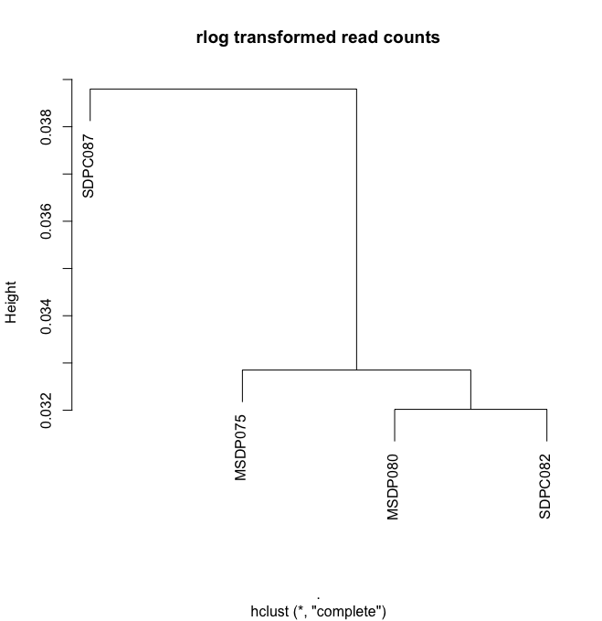
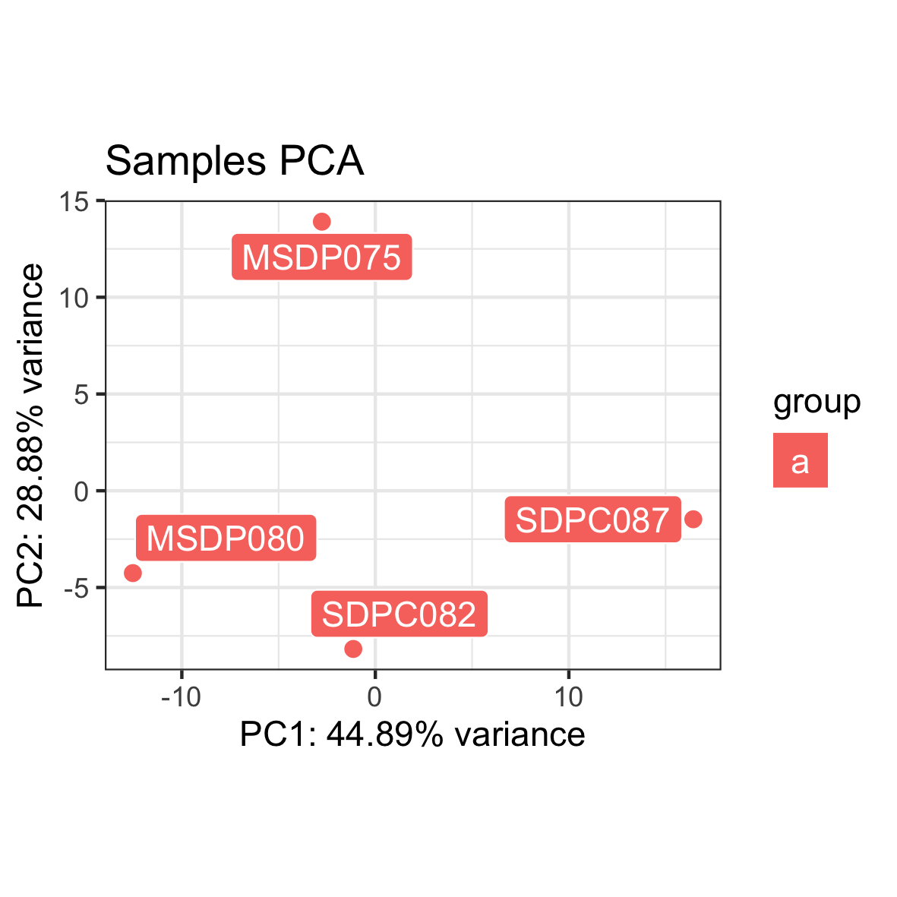
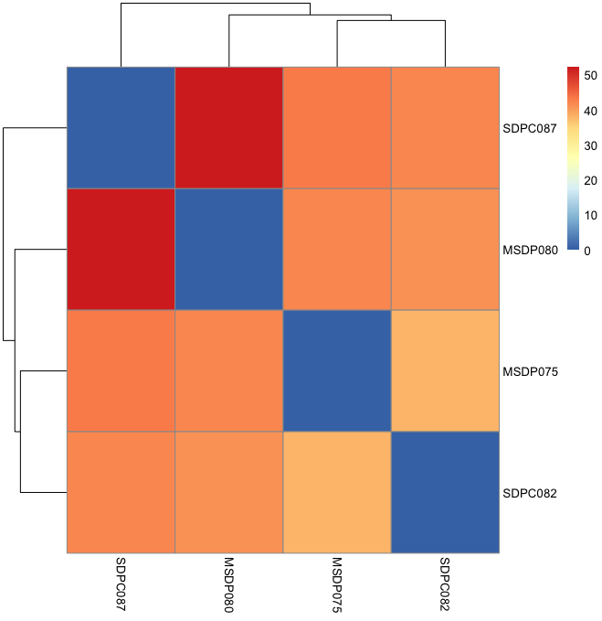

```{r setup, include=FALSE}
knitr::opts_chunk$set(echo = TRUE)
```

## DESeq Analysis
In this project, I'm going to measure the transcriptomic difference between healthy people and people with major depression. In my dataset, there are four samples SDPC082, SDPC087, MSDP075 and MSDP080. Samples that start with SDPC are healthy and that start with MSDP have depressive disorder. Below are some plots generated by DESeq. 

From the dengrogram and pca plot, I find that there's no significant difference between two groups. What even surprising me is that SDPC082 is similar to those in healthy group. I also find out that only SDPC087 is male and others are female. I should include more data into my analysis to make sure there is difference between healthy and depressive people with more even sex distribution. 








