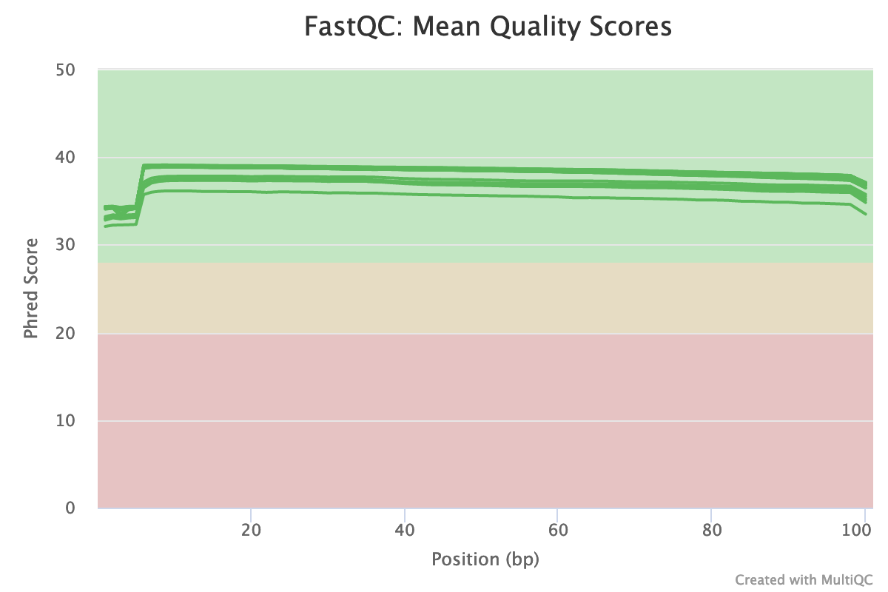
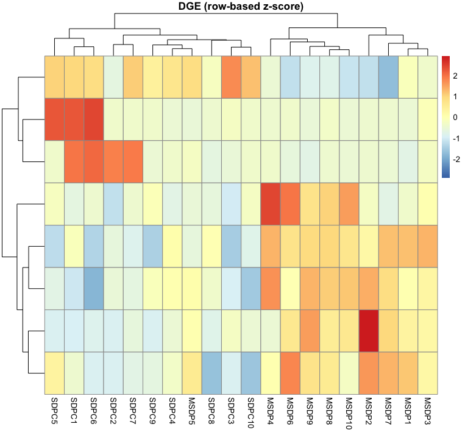
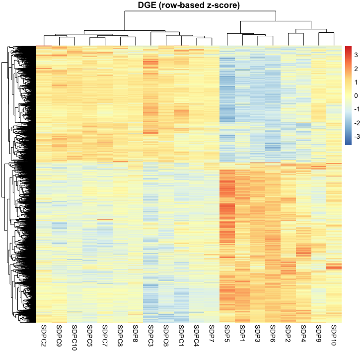
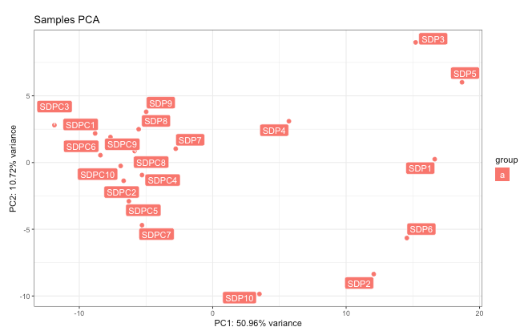
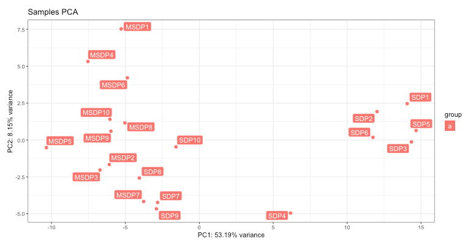
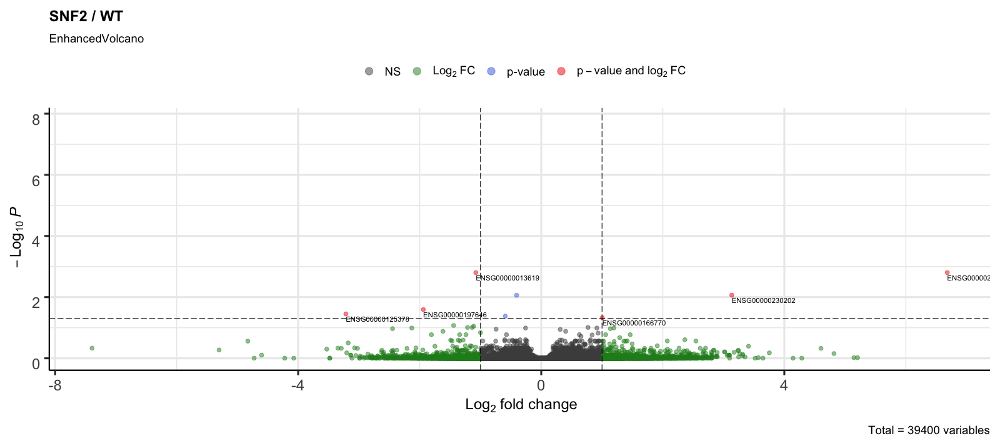
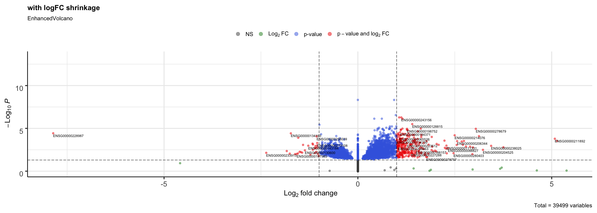

```{r setup, include=FALSE}
knitr::opts_chunk$set(echo = TRUE)
```

# Introduction
    
Depression, a mental health disorder characterized by persistently depressed mood or loss of interest in activities, causing significant impairment in daily life also refers to a depressed topography or the fact of being pressed down (Kanter, 2008). More than 300 million people worldwide experience depression; annually, ~800,000 people die by suicide (Bhak, 2019). Previous research also found that most US adults who screen positive for depression did not receive treatment for depression, whereas most who were treated did not screen positive. In light of these findings, it is important to strengthen efforts to align depression care with each patient’s clinical needs (Olfson, 2016). It's important to know genes that over or under express between these people in order to improve the health treatment or even prevent the happening of depression. In this research, I would like to analyze the genetic difference between healthy people and people with major depression. My hypothesis is there is difference between these samples. To futher verify my hypothesis, I used the RNAseq data from Korean Genomics Industrialization and Commercialization Center (KOGIC) and Ulsan National Institute of Science and Technology (UNIST). This data has 56 suicide attempters (SDP), 39 patients with major depressive disorder (MDPC), and 87 healthy controls (SDPC) and were all sampled from peripheral blood cells. In my analysis, I randomly select 10 samples from each class and ended up 30 samples in my case. 
    
    

# Results

Based on my 30 samples, I found that there are major difference between healthy people and suicide attempters but sightly difference between healthy people and people with major depression disorder. From the QC plot from Fig a., all the samples have high quality scores. From the heatmap below (Fig 1. and Fig 2.), most genes were filtered out due to not passing the threshold of adjusted p value (0.05 in our case). Also, the difference of gene expression is more clear in between SDPC and SDP. The same results can also be found in PCA plots (Fig 3. and Fig 4.). We found that there is a clear cluster in Fig 3. which indicated the similar expression of genes in class SDP. We can use the volcano plots to analyze the over and under expressive genes (Fig 5. and Fig 6.). Genes like LILRB2 and IGHG4 are highly expressive in suicide attempters. These genes are immunoglobulin encoding genes. 

There are some possible future experiments to enhance the analysis. The first one is the sample size, it would be nice to include more samples for each class in order to obeserve the difference. Also, More samples mean the result will become more robust. Secondly, the samples were extracted from peripheral blood, however, it might be interesting to analyze samples from different cell types like nerve cells or muscle cells.


















# Methods

The detailed scripts can be found in the github repo (https://github.com/tim02468/ANGSD-Course-2020).

## Download Data
   
To download the data, I use the NCBI website (https://www.ncbi.nlm.nih.gov/sra?linkname=bioproject_sra_all&from_uid=531784) and download 20 samples for down stream analysis randomly. There are 10 samples for MSDP (MajorDepressiveDisorderPatient) and 10 samples for SDPC (HealthyControl). Use `wget` to download the fastq files for each sample. Take MSDP078 for an example, first, go to `https://trace.ncbi.nlm.nih.gov/Traces/sra/?run=SRR9190744` and used the code below to download the fastq files.

```{bash , eval=FALSE}
wget https://sra-pub-src-2.s3.amazonaws.com/SRR9190744/MSDP078-R_1.fastq.gz.1
wget https://sra-pub-src-2.s3.amazonaws.com/SRR9190744/MSDP078-R_2.fastq.gz.1
```
    
## Fastqc analysis
  
To run the fastqc on all samples, I stored all the pathes of fastq files in `info.txt` and execute code below to perform fastqc (v0.11.7) on the samples. Then I loaded the multiqc using `spack load -r py-multiqc` and `multiqc .` in the folder of fastqc files.
    
```{bash, eval=FALSE}
#! /bin/bash

spack load fastqc

for path in $(cat info.txt); do fastqc $path -o ./fastqc/ --extract; done
```
    

## Sequence alignment

To run the alignment on the samples, I used two bash files `run_align.sh` and `align_human.sh`. To speed up running time, I requested for 16 ntasks to parallelize the processes. Also requesting 40G memory to prevent memory leakage.
    
```{bash run_align.sh, eval=FALSE}
#! /bin/bash

#SBATCH  --partition=angsd_class
#SBATCH  --nodes=1
#SBATCH  --ntasks=16
#SBATCH  --job-name=angsd_project925
#SBATCH  --time=24:00:00   
#SBATCH  --mem=40G 

for sample in `echo $(cat samples.txt)`; do ./align_human.sh ./ref_gene/hg38_index ./raw_reads ${sample}; done 
```


```{bash align_human.sh, eval=FALSE}
#! /bin/bash

# Usage: align_Gierlinski.sh <STARindex_dir> <FASTQ_dir> <SAMPLE NAME>
# Make sure that STAR has been loaded and is accessible via `STAR` and that
# the genome/transcriptome index has already been built.

# Check that we have our command line argument(s)
arg_count=$#
if [ $arg_count -lt 3 ]; then
	echo "Not enough command line arguments. Exiting ..."
	echo "Usage: align_Gierlinski.sh <STARindex_dir> <FASTQ_dir> <SAMPLE NAME>"
	exit
fi 

# Read in arguments
STAR_DIR=$1
FASTQ_DIR=$2
SAMPLE=$3

# Load packages
spack load star@2.7.0e
spack load samtools@1.9%gcc@6.3.0

echo "Aligning files for ${SAMPLE}, files:"
# echo $FILES 
STAR --genomeDir ${STAR_DIR}/ --readFilesIn ./${FASTQ_DIR}/${SAMPLE}/${SAMPLE}-R_1.fastq.gz.1 ./${FASTQ_DIR}/${SAMPLE}/${SAMPLE}-R_2.fastq.gz.1 --readFilesCommand zcat --outFileNamePrefix ./alignments/${SAMPLE}. --outSAMtype BAM SortedByCoordinate --runThreadN 4 --twopassMode Basic

echo "Indexing files for ${SAMPLE}, files:"
samtools index ./alignments/${SAMPLE}.Aligned.sortedByCoord.out.bam
```


## Read counts table

To generate the read counts table, I first loaded the package using `spack load subread`. Then using `featureCounts -a ref_gene/hg38.ensGene.gtf -o featCounts_human.txt ./alignment/*.bam` to generate the read counts table for down stream analysis.


## DEseq analysis

Below is the script for running DESeq analysis, here I used the read counts table for the previous step and perform preprocessing before generating the figures. I used `rlog` for normalization, 'hclust' for dendrogram and 'plotPCA' for PCA. These two figures are suitable for obervation of sample clustering.

```{r eval=FALSE}
library(ggplot2)
library(DESeq2)
library(magrittr)

df <- read.table("../data/featureCounts_human.txt", header = TRUE, stringsAsFactors = FALSE)
head(df)

names(df) <- c(names(df)[1:6], sprintf("MSDP%s", seq(1:10)), sprintf("SDP%s", seq(1:10)), sprintf("SDPC%s", seq(1:10)))
# names(df) <- c(names(df)[1:6], sprintf("MSDP%s", seq(1:20)), sprintf("SDPC%s", seq(1:10)))
row.names(df) <- make.names(df$Geneid)

## Compare SDPC and MSDP
# df <- df[c(names(df)[1:6], sprintf("SDPC%s", seq(1:10)), sprintf("MSDP%s", seq(1:10)))]

## Compare SDPC and SDP
df <- df[c(names(df)[1:6], sprintf("SDP%s", seq(1:10)), sprintf("SDPC%s", seq(1:10)))]

df <- df[ ,-c(1:6)]
col_data <- DataFrame(condition = gsub("[0-9]+", "", names(df)), row.names = names(df))

# Create DESeq object
DESeq.df <- DESeqDataSetFromMatrix(countData = df, colData = col_data, design = ~ condition)
dim(DESeq.df)

# remove genes that have no counts
DESeq.df <- DESeq.df[rowSums(counts(DESeq.df)) > 0, ]
dim(DESeq.df)


# calculate SFs and add them to the object
DESeq.df <- estimateSizeFactors(DESeq.df)

plot(sizeFactors(DESeq.df), colSums(counts(DESeq.df)), ylab = "library size", xlab = "size factors")


# assign log normalized counts to a matrix
assay(DESeq.df, "log.norm.counts") <- log2(counts(DESeq.df, normalized = TRUE) + 1)

DESeq.rlog <- rlog(DESeq.df, blind = TRUE)

# plot dendrogram
corr_coeff <- cor(assay(DESeq.df, "log.norm.counts"), method = "pearson")
rlog.norm.counts <- assay(DESeq.df, "log.norm.counts")
as.dist(1-corr_coeff) %>% hclust %>% plot( ., labels = colnames(rlog.norm.counts),main = "rlog transformed read counts")

# run pca and plot the result
pca_data <- plotPCA(DESeq.rlog, returnData=TRUE)

p <- ggplot(pca_data,aes(x=PC1,y=PC2,color=group))
p <- p+geom_point()
p

# run pcaExplorer
# pcaExplorer::pcaExplorer(dds = DESeq.df, dst = DESeq.rlog)

```


## Differential gene expression analysis

Here I performed differential gene expression (DGE) analysis on my DESeq object. First I used `DESeq` to run the DE analysis. Then I used `result` to extract the base means across samples, log2 fold changes, standard errors, and test statistics for every gene. Then, I filtered out genes that have adjusted p-value over 0.05 and assigned it to `DGEgenes`. Last, in order to observe the difference after filtering genes that do not pass the adjusted p-value threshold. Also, I generated heatmaps and volcano plots using `pheatmap` and `plotMA`.

```{r eval=FALSE}
library(pheatmap)
library(EnhancedVolcano)

# run DESeq test
DESeq.df <- DESeq(DESeq.df)

# relevel
DESeq.df$condition <- relevel(DESeq.df$condition, ref="SDPC")

DGE.results <- results(DESeq.df, independentFiltering = TRUE, alpha = 0.05)
# the first line will tell you which comparison was done to achieve the log2FC
head(DGE.results)


hist(DGE.results$padj,
     col="grey", border="white", xlab="", ylab="", main="frequencies of adj. p-values\n(all genes)", cex = 0.4)

# filter genes with p-val >= 0.05
DGEgenes <- rownames(subset(DGE.results, padj < 0.05))

# extract rlog-transformed values into a matrix
rlog.dge <- DESeq.rlog[DGEgenes,] %>% assay

# show dendrogram and pca using filtered rlog.dge
corr_coeff <- cor(rlog.dge, method = "pearson")
rlog.norm.counts <- assay(DESeq.df[DGEgenes,], "log.norm.counts")
as.dist(1-corr_coeff) %>% hclust %>% plot( ., labels = colnames(rlog.norm.counts),main = "rlog transformed read counts")

pca_data <- plotPCA(DESeq.rlog[DGEgenes,], returnData=TRUE)

p <- ggplot(pca_data,aes(x=PC1,y=PC2,color=group))
p <- p+geom_point()
p


# generate heatmap
pheatmap(rlog.dge, scale="row",
         show_rownames = FALSE, main = "DGE (row-based z-score)")


# perform Shrinking the logFC values
DGE.results.shrnk <- lfcShrink(DESeq.df, coef = 2, type = "apeglm")

plotMA(DGE.results.shrnk,
       alpha = 0.05,
       main = "with logFC shrinkage", ylim = c(-4,4))


vp2 <- EnhancedVolcano(DGE.results.shrnk, lab = rownames(DGE.results.shrnk),
                       x = 'log2FoldChange',
                       y = 'padj', pCutoff = 0.05,
                       title = "with logFC shrinkage")

```


# Discussion

Last, this data set has three major limitations. First, ages of samples of healthy control range from 22 to 28 and ages of samples with major depression disorder which range from 21 to 43. The limitation here is we are not able to analyze samples that are older or younger. Secondly, this data set was contributed by people from South Korean, however, the results might be different from different races. Last, the limitation of sample size, there are total 182 samples in this data set. In order to find a strong difference between healthy people and people with major depression disorder, more samples would need to be collected.

To conclude, the data shows difference between healthy people and suicide attempters but this tendency wasn't revealed in samples of health people and people with depression disorder. Thus, furhter experiments need to be conducted in order to find a more convinced and robust correlations in these samples.


# Key Data Sets

* Bam files

* Feature Counts

* DESeq Object

* DGEgenes

* DGE.results.shrnk


## References

* Bhak, Y., Jeong, H., Cho, Y.S. et al. Depression and suicide risk prediction models using blood-derived multi-omics data. Transl Psychiatry 9, 262 (2019). https://doi.org/10.1038/s41398-019-0595-2

* Kanter, J. W., Busch, A. M., Weeks, C. E., & Landes, S. J. (2008). The nature of clinical depression: symptoms, syndromes, and behavior analysis. The Behavior analyst, 31(1), 1–21. https://doi.org/10.1007/bf03392158

* Olfson M, Blanco C, Marcus SC. Treatment of Adult Depression in the United States. JAMA Intern Med. 2016;176(10):1482–1491. doi:10.1001/jamainternmed.2016.5057


